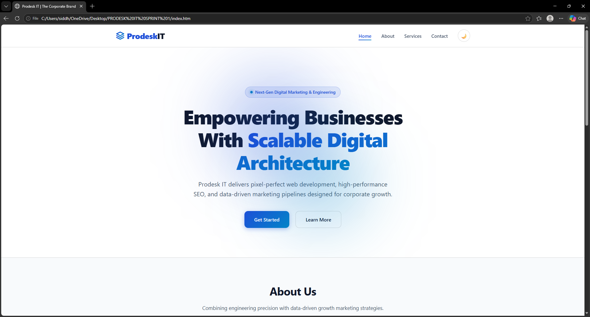

# Prodesk IT - Corporate Landing Page (Sprint 1)

This repository contains the Sprint 1 frontend deliverable for "Prodesk IT", a corporate digital marketing and engineering landing page.

## Live Demo
**Live URL:** [https://prodesk-corporate-brand.vercel.app/]  

## Project Screenshot
 

## Architecture & Tech Stack
This project was built strictly adhering to Phase 1 and Phase 2 requirements using raw foundational web technologies (No frameworks like Bootstrap or Tailwind were used):
- **HTML5:** Semantic architecture (`<header>`, `<main>`, `<article>`) for 100/100 Accessibility.
- **CSS3 (Vanilla):** CSS Variables (`:root`), Flexbox (Navbar alignment), CSS Grid (Card layouts), and Glassmorphism (`backdrop-filter`).
- **JavaScript (Vanilla):** DOM Manipulation, `localStorage` for theme persistence, and Scroll Spy logic.

## Key Features Implemented
- **Phase 1 (Base MVP):** Fully responsive Mobile-First design, Custom SVG Logo, CSS Grid Services module, and functional Hamburger menu.
- **Phase 2 (UI/UX Enhancements):** 
  - Dynamic Dark/Light Theme Controller (Saves to `localStorage`).
  - Sticky Glassmorphism Navigation.
  - Z-axis 3D lifting micro-interactions on Service Cards.
- **Stretch Goals Achieved:** 100/100 Lighthouse Performance, Accessibility, Best Practices, and SEO score.

---
*Developed by Siddhant Thapa for Sprint 01.*
